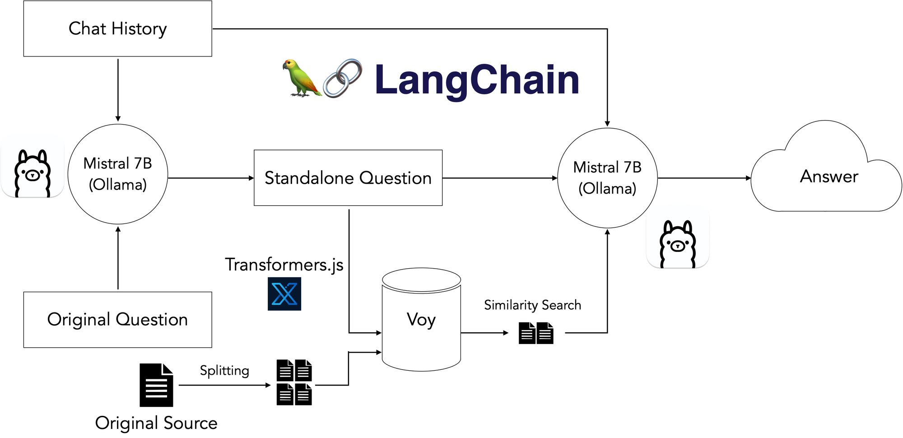

# ollama

## How to start

similar like docker

- pull, run ...

## Advanced

### http server

`ollama serve` at `http://localhost:11434`

### [Building LLM-Powered Web Apps with Client-Side Technology](https://ollama.com/blog/building-llm-powered-web-apps)

> The general idea here is to take the user’s input question, search our prepared vectorstore for document chunks most semantically similar to the query, and use the retrieved chunks plus the original question to guide the LLM to a final answer based on our input data.
>
> There’s an additional step required for followup questions, which may contain pronouns or other references to prior chat history. Because vectorstores perform retrieval by semantic similarity, these references can throw off retrieval. Therefore, we add an additional dereferencing step that rephrases the initial step into a “standalone” question before using that question to search our vectorstore.

## sample: library-reader

A simple app to showcase how to create a RAG application with opensource toolchains, and running locally.

### architecture

There are 2 phases for RAG application generally ...

- Build the memory - documents to embeddings
- Query with context - combine memory, history, prompt as input question

In this POC, we only handle static documents (no runtime add/update).

To build/deploy it easily, we separate it to components:

- Document Loader: download files from s3/git to filesystem

> in production, you can extend this to fetch data from more datasources, periodically.

- Embedding: parse and convert documents to vectors

> in production, you can update the embeddings periodically.

- Vector storage: store/query the vectors
- Chatbot: orchestrate question/answer and context
- Server: expose chatbot as api
- UI: end user interface

### Reference

- [【官方教程】ChatGLM + LangChain 实践培训](https://www.bilibili.com/video/BV13M4y1e7cN/?share_source=copy_web&vd_source=e6c5aafe684f30fbe41925d61ca6d514)
